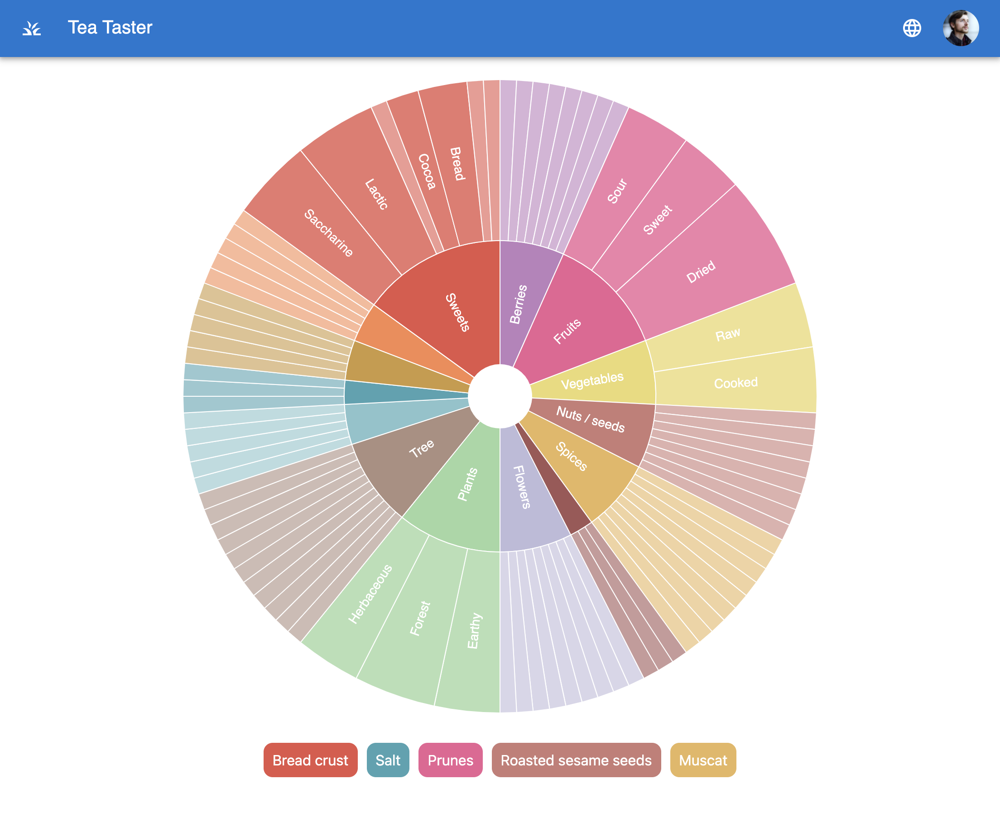

# Tea Taster

This is a simple pet-project for learning React.js.

.


A project represents an aroma circle for Tea Ceremony. The circle is displayed as an interactive
zoomable sunburst diagram where a user can navigate through aroma categories and pick aromas he
can feel while tasting a Chinese tea.

## Features

- Authentication with OAuth2 via Github, Google, Facebook
- i18n with EN and UA locales
- Interactive Aroma diagram
- List of picked aromas below

## Used libs and technologies

Typescript, React.js, Next.js, Material UI, CSS Modules, auth-next, i18next, Docker. 

## Getting Started

First, run the development server:

```bash
npm run dev
# or
yarn dev
```

Open [http://localhost:3000](http://localhost:3000) with your browser to see the result.
